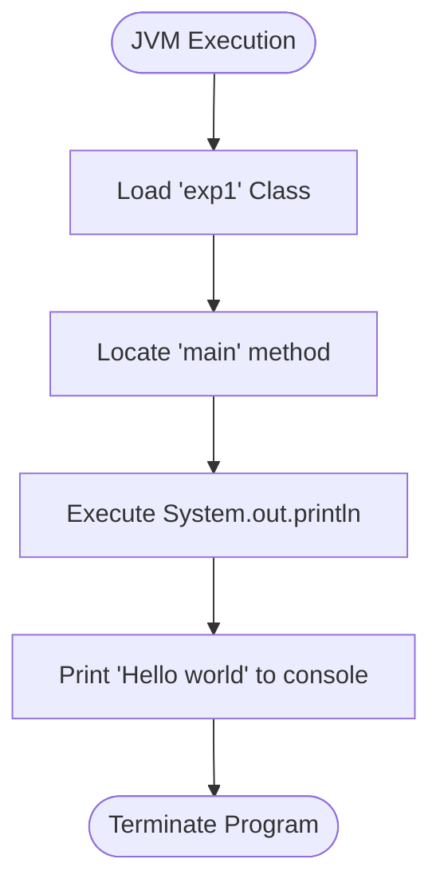

# ☕ Experiment 1: Java Fundamentals

> The classic introductory "Hello World" program in Java, establishing the foundation of object-oriented syntax.

---

## 🎯 Overview

This Java file (`exp1.java`) showcases the minimal required structure to execute a program in the Java Runtime Environment (JRE). It defines a public class and the essential `main` method entry point.

## ✨ Concepts Explained

### 1. Class Declaration
In Java, all code must reside within a class. `public class exp1` defines the blueprint.

### 2. Main Method
`public static void main(String[] args)` is the exact signature the JVM (Java Virtual Machine) looks for to begin executing the program.
* **`public`**: Anyone can access it.
* **`static`**: The method belongs to the class itself, not an instantiated object.
* **`void`**: It does not return any value.

### 3. Standard Output
`System.out.println` is used to print text to the console, followed by a newline character.

---

## 🔄 Execution Flowchart



---

## 🚀 Running the Code

1. Open your terminal and navigate to this directory.
2. Compile the Java file into bytecode:
   ```bash
   javac exp1.java
   ```
3. Run the compiled object class:
   ```bash
   java exp1
   ```
