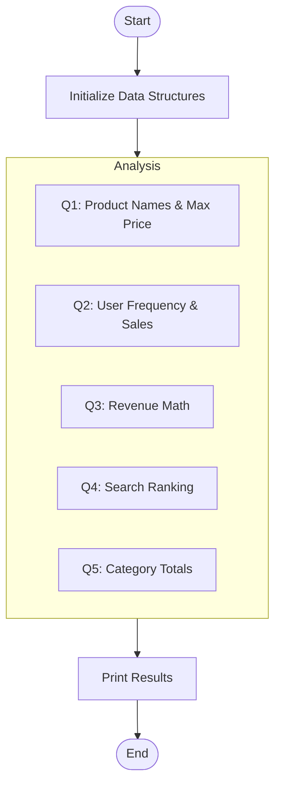

# 📦 DSA Lab Experiment: Revision of Built-In Data Structures

> A comprehensive Python exercise analyzing e-commerce data using only built-in data structures (Lists, Tuples, and Dictionaries).

---

## 🎯 Objective
An e-commerce company wants to analyze its data to understand product demand, customer activity, and sales performance. This experiment focuses on core data manipulation skills without external libraries.

---

## 📂 Datasets Used

### 1. `products` (List of Tuples)
Contains product details as `(ProductID, ProductName, Category, Price)`.
```python
products = [
    (101, "Mobile", "Electronics", 20000),
    (102, "Laptop", "Electronics", 55000),
    (103, "Shoes", "Fashion", 3000),
    (104, "Watch", "Fashion", 2500),
    (105, "Headphones", "Electronics", 1500)
]
```

### 2. `purchases` (List of Tuples)
Contains customer records as `(UserName, ProductID, QuantityPurchased)`.
```python
purchases = [
    ("User1", 101, 1),
    ("User2", 103, 2),
    ("User1", 102, 1),
    ("User3", 101, 1),
    ("User2", 105, 3)
]
```

### 3. `searches` (List of Strings)
Contains product names searched by users.
```python
searches = ["Mobile", "Shoes", "Mobile", "Laptop", "Mobile", "Watch"]
```

---

## 🧪 Analysis Questions & Results

### Q1. Product Analysis
1. **Product Names:** `['Mobile', 'Laptop', 'Shoes', 'Watch', 'Headphones']`
2. **Costliest Product:** `Laptop (55000)`
3. **Category Counts:** `{'Electronics': 3, 'Fashion': 2}`

### Q2. Purchase Analysis
1. **User Purchases:** `{'User1': 2, 'User2': 5, 'User3': 1}`
2. **Top User:** `User2 (5 items)`
3. **Sales Quantity:** `{101: 2, 102: 1, 103: 2, 104: 0, 105: 3}`

### Q3. Revenue Calculation
1. **Product Revenues:** `{'Mobile': 40000, 'Laptop': 55000, 'Shoes': 6000, 'Watch': 0, 'Headphones': 4500}`
2. **Total Store Revenue:** `105,500`

### Q4. Search Trend Analysis
1. **Search Frequency:** `{'Shoes': 1, 'Laptop': 1, 'Watch': 1, 'Mobile': 3}`
2. **Most Searched:** `Mobile`

### Q5. Category Performance
1. **Category Sales:** `{'Electronics': 6, 'Fashion': 2}`
2. **Best Category:** `Electronics (6 items sold)`

---

## 🛠️ Implementation Highlights
The solution utilizes high-performance built-in Python techniques:
- **List Comprehensions** for efficient data extraction.
- **Dict Comprehensions** for rapid frequency mapping.
- **Set Operations** for unique category identification.
- **Built-in Functions** (`max`, `sum`, `count`) for optimized calculations.

---

## 🚀 How to Run
```bash
python3 exp_1.py
```

---

## 🔄 Logic Flowchart


