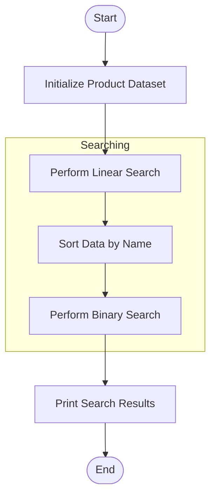

# 🔍 DSA Lab Experiment 6: Searching Algorithms

> Implementation and analysis of Linear Search and Binary Search algorithms on a dataset of Product objects.

---

## 🎯 Objective
Study and compare the performance and efficiency of **Linear Search** and **Binary Search** algorithms. 
- **Linear Search**: Checks every element sequentially until the target is found. Great for unsorted data.
- **Binary Search**: Divide-and-conquer strategy on sorted data. Significantly faster for large datasets.

---

## 📂 Dataset Details

The experiment uses a custom `Product` class to model real-world data:
```python
class Product:
    def __init__(self, name, price):
        self.name = name
        self.price = price
```

### 🧬 Sample Data (Unsorted Initial State)
| Product Name | Price |
| :--- | :--- |
| Product1 | 10.99 |
| Product2 | 24.99 |
| Product3 | 34.99 |
| Product4 | 14.99 |
| Product5 | 19.99 |

---

## 🛠️ Implementation Details

### 1. Linear Search
Iterates through the list element-by-element.
- **Time Complexity**: O(n)
- **Best for**: Small or unsorted datasets.

### 2. Binary Search
Requires the data to be sorted (in this case, by `name`).
- **Time Complexity**: O(log n)
- **Workflow**: 
    1. Sort the dataset: `dataset.sort(key=lambda x: x.name)`
    2. Repeatedly divide the search interval in half.

---

## 🧪 Results
When searching for **"Product3"**:

| Algorithm | Result | Index |
| :--- | :--- | :--- |
| **Linear Search** | ✅ Found | 2 |
| **Binary Search** | ✅ Found | 2 |

---

## 🚀 How to Run
```bash
python3 exp_6_linear_binary_search.py
```

---

## 🔄 Search Logic Flowchart


