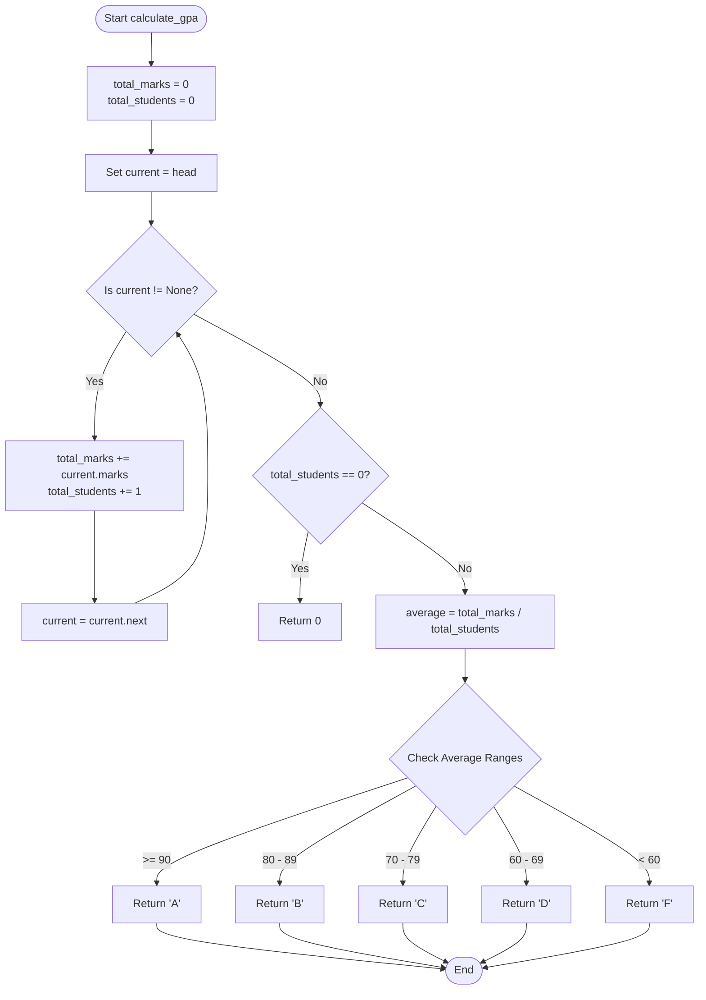

# 🔗 Experiment 2: Student GPA Management with Linked Lists

> A custom Singly Linked List implementation in Python, applied to a real-world scenario of managing student records and dynamically computing GPAs.

---

## 🎯 Overview

This project includes both a Python script (`exp_2_linkedlist.py`) and a Jupyter Notebook (`exp_2_linkedlist.ipynb`) demonstrating the mechanics of a **Singly Linked List**. Rather than storing abstract data, the nodes in this linked list hold structured information about students (name, roll number, and marks), making it a practical example of custom objects in linked data structures.

## ✨ Features

- **Custom Node Structure**: Each `Node` holds multi-attribute student data and a pointer to the next record.
- **Dynamic Insertion**: The `add_student()` method prepends a new record to the beginning of the list ($O(1)$ time complexity).
- **Sequential Traversal**: The `display_students()` method traverses the list from the `head` to print every student's details ($O(N)$ time complexity).
- **Aggregate Computation**: The `calculate_gpa()` method processes the entire list to compute an average score and assigns an alphabetically graded GPA based on that average.

---

## 🔄 Logic & Architecture

### Class Structure

1. **`Node` Class**: Acts as the container for a single student. It has four attributes: `name`, `roll_number`, `marks`, and `next` (the pointer).
2. **`LinkedList` Class**: Manages the collection of Nodes. It holds a single reference, `head`, pointing to the first student in the list.

### GPA Calculation Flowchart



---

## 🚀 Running the Code

You can explore this logic in two ways:

1. **Using the Python Script**:
   Navigate to the directory and run the script directly:
   ```bash
   python exp_2_linkedlist.py
   ```
   This will execute the `if __name__ == "__main__":` block, populating a mock list of students and printing the computed GPA.

2. **Using the Jupyter Notebook**:
   Open `exp_2_linkedlist.ipynb` to step through the class definitions interactively.
